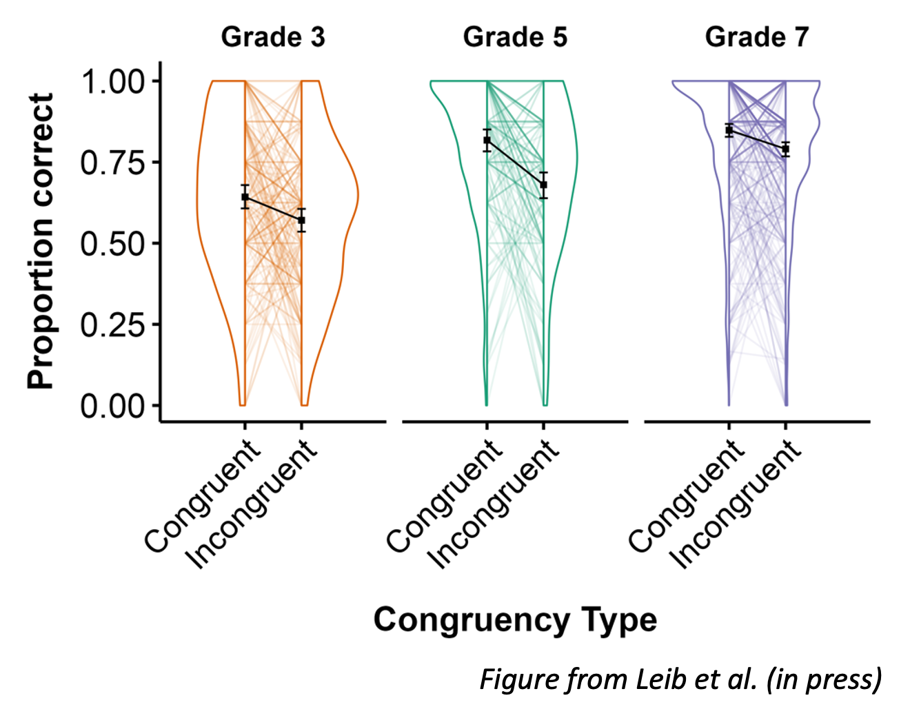

# Code for beautiful graphs
This repository has various R scripts with code that I've written to make beautiful graphs! Each script includes an example dataset so you can see how the code works and the resulting graph. 

## corset_plots.R
This script has code that I wrote to make faceted corset plots (see Leib et al., accepted, Dev Psych), such as this one:

This corset plot is from Leib et al. (in press). Participants completed a set of fraction comparison problems that were either congruent with whole number knowledge or incongruent. The plot shows proportion correct by congruency type for participants in grades 3, 5, and 7. Each colored line connects a participant’s averages on congruent and incongruent problems. The black points represent the overall mean, and the black lines connect these means. Error bars indicate the bootstrapped 95% confidence intervals around the means.

This code could be used anytime a participant has two data points in a sample (e.g., pre and post-test) and you want to plot the change between them for individual participants and at a group level.

