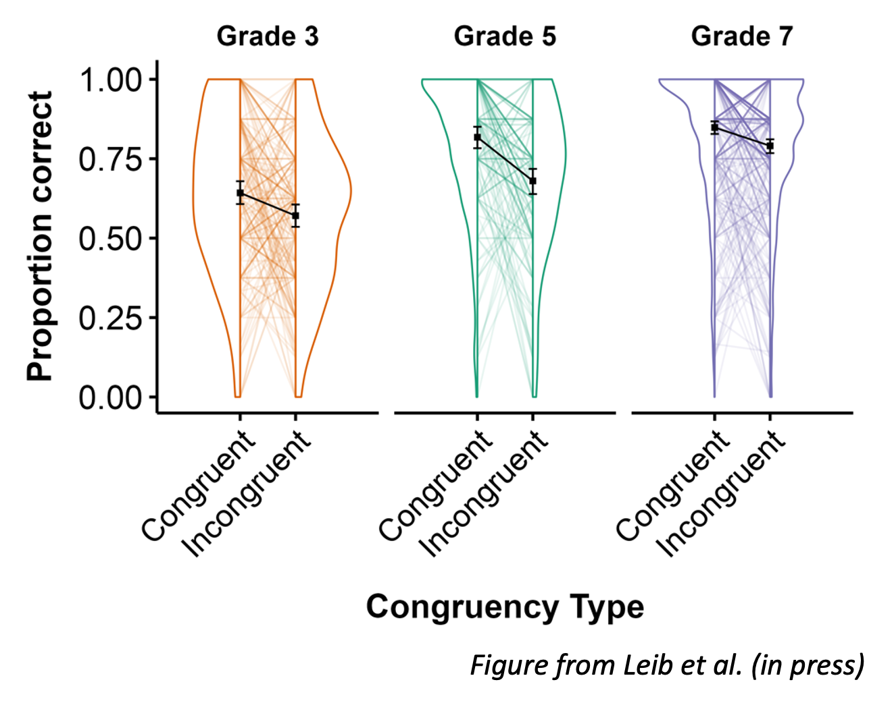

# Code for beautiful graphs
This repository has various R scripts with code that I've written to make beautiful graphs! Each script includes an example dataset so you can see how the code works and the resulting graph. 

## corset_plots.R
This script has code that I wrote to make faceted corset plots (see Leib et al., accepted, Dev Psych), such as this one:

However, this code could be used anytime a participant has two data points in a sample (e.g., pre and post-test) and you want to plot the change between that for individual participants, and at a group level.

